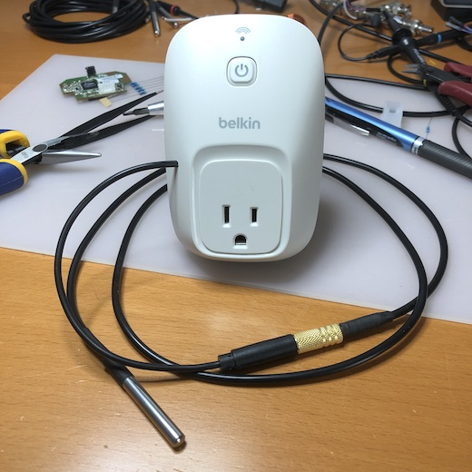
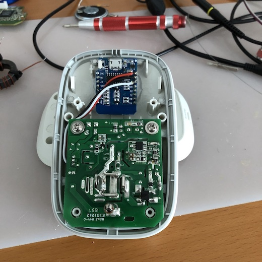
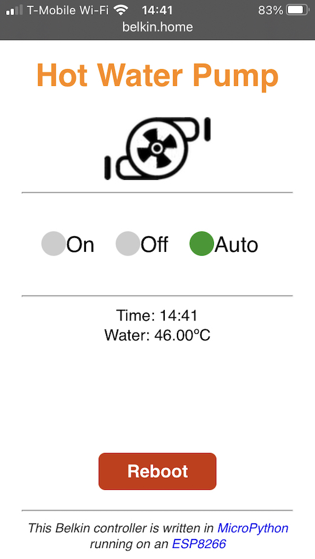

# blkin

Old Belkin switch using an ESP8266

I had an older generation of Belkin WeMo Switch in my garage. I
decided to give him a new life by removing the WiFi controller inside
and replacing it with an ESP8266.

I am now using this switch to run my hot water recirculating pump. I
wrote the firmware using [MicoPython][1]. The firmware runs the pump at
a specific time of day.

A web interface allows seeing the status of the pump. As well as for
it to run. Pressing the `On` button will run the pump for a few
minutes, just enough time to bring the hot water into the pipes.

This is the WeMo Switch with the ESP8266 D1 mini board installed.

Screen shot of the web interface.

